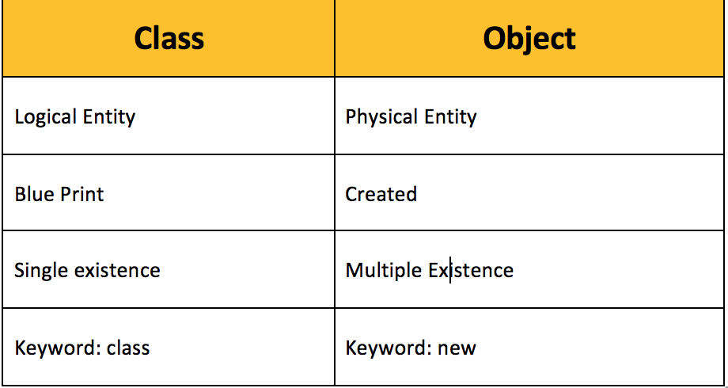

# Core Java
## What's enough for an SDET

Note: Lets KILL this
---

# Chapter - 1

## Understanding @color[blue](**Classes**)

+++

## What it contains ?
<font size = 16>
- Variables  <!-- .element: class="fragment" -->
- Methods  <!-- .element: class="fragment" -->
- Constructors  <!-- .element: class="fragment" -->
- Instance Block  <!-- .element: class="fragment" -->
- Static Block  <!-- .element: class="fragment" -->

+++

## We need to know

<font size = 16>
```
  DataTypes
  FlowControl
  ExceptionHandling
  Objects
  Methods
  SourceFiles
  Modifiers
```
<span class="code-presenting-annotation fragment current-only" data-code-focus="1">@color[blue](byte, short, int, long, float, double, char, boolean)</span>
<span class="code-presenting-annotation fragment current-only" data-code-focus="2">@color[blue](if, else, switch, case, default, break, for, while, do, continue)</span>
<span class="code-presenting-annotation fragment current-only" data-code-focus="3">@color[blue](try, catch, finally, throws, throw)</span>
<span class="code-presenting-annotation fragment current-only" data-code-focus="4">@color[blue](new, this, super, instanceof)</span>
<span class="code-presenting-annotation fragment current-only" data-code-focus="5">@color[blue](void, return)</span>
<span class="code-presenting-annotation fragment current-only" data-code-focus="6">@color[blue](class, extends, interface, implements, package, import)</span>
<span class="code-presenting-annotation fragment current-only" data-code-focus="7">@color[blue](public, private, protected, final, static, abstract)</span>                                              

+++

## Handling data in variables

+++

## What are datatypes ???

+++

## Datatypes

<font size = 16>
```
    byte
    short
    int
    long
    float
    double
    char
    boolean
```

<span class="code-presenting-annotation fragment current-only" data-code-focus="1">@color[red](Size: 1 byte - Default: 0)</span>
<span class="code-presenting-annotation fragment current-only" data-code-focus="2">@color[red](Size: 2 bytes - Default: 0)</span>
<span class="code-presenting-annotation fragment current-only" data-code-focus="3">@color[red](Size: 4 bytes - Default: 0)</span>
<span class="code-presenting-annotation fragment current-only" data-code-focus="4">@color[red](Size: 8 bytes - Default: 0)</span>
<span class="code-presenting-annotation fragment current-only" data-code-focus="5">@color[red](Size: 4 bytes - Default: 0.0)</span>
<span class="code-presenting-annotation fragment current-only" data-code-focus="6">@color[red](Size: 8 bytes - Default: 0.0)</span>
<span class="code-presenting-annotation fragment current-only" data-code-focus="7">@color[red](Size: 2 bytes - Default: < > //space)</span>
<span class="code-presenting-annotation fragment current-only" data-code-focus="8">@color[red](Size: NA - Default: false)</span>

+++

## What are variables ???

+++

## LOCAL

- Declared inside a method/constructor/block 
- Scope limits within the declared method/constructor/block 
- Memory allocated when execution of method/constructor/block begins 
- Memory released when execution of method/constructor/block completes 

+++

## Instance

- Declared inside the class, but outside of any method/constructor/block
- Scope limits within the class, across all method/constructor/block(s), with reference to class object
- Memory allocated when class object is created
- Memory released when class object is destroyed

+++

## Static

- Declared inside the class, but outside of any method with Static prefix
- Scope limits with the class
- Memory allocated when .class file loaded into JVM
- Memory released when JVM completes execution

+++

## Instance @color[red](VS) Static

- Access instance variables from instance area
- Access instance variables from static area
- Access static variables from instance area
- Access static variables from static area

+++

## Variables @color[red](VS) Default values

- Assignment @color[red](VS) Default for static
- Assignment @color[red](VS) Default for instance
- Assignment @color[red](VS) Default for local

+++

## Class @color[red](VS) Objects



+++

## Classification


```
Primitive
Class
Array
ENUM
```

<span class="code-presenting-annotation fragment current-only" data-code-focus="1">@color[red](int i = 10)</span>
<span class="code-presenting-annotation fragment current-only" data-code-focus="1">@color[red](float f = 10.0)</span>
<span class="code-presenting-annotation fragment current-only" data-code-focus="2">@color[red](Test t = new Test())</span>
<span class="code-presenting-annotation fragment current-only" data-code-focus="2">@color[red](Employee e = new Employee())</span>
<span class="code-presenting-annotation fragment current-only" data-code-focus="3">@color[red](int[] numbers)</span>
<span class="code-presenting-annotation fragment current-only" data-code-focus="3">@color[red](String[] strings)</span>

+++

## Segregating business logics

+++

## Methods - what && why ??

+++

## Syntax

- Modifier Return-Type Method-Name(params list) throws <exception> { }
- @color[blue](Modifier) - Access permission (public, private) 
- @color[blue](Return-Type) - Method response (void, int, boolean, <classname>) 
- @color[blue](Method signature) - Combination of method name and param list  
- @color[blue](Classification) - Instance and Static methods 

+++

## Instance Methods

- Access using Objects 
- Loaded at the object creation time

+++

## Static Methods

- Access using class name
- Loaded at the time of class loading

+++

## Constructors

+++

## What is constructor ??@color[red](?)??

+++

## Types of constructors

- No Param constructors 
- Param constructors

+++

## Param @color[red](VS) No-Param constructors

- Default Constructor 
- Custom Constructors

+++

## Instance Block

+++

## What is Instance Block @color[red](?)

+++

## Why, why & why @color[red](?)

- Holds business logic to be executed at the time of object creation 
- Use to initialize instance variables during object creation

+++

## Instance Block @color[red](VS) Constructors

- Instance blocks are executed before constructors 
- Instance blocks are common for all objects 
- Constructors are specific to object

+++

## Static Block

+++

## What is Static Block @color[red](?)

+++

## Why, why & why @color[red](?)

- Holds business logic to be executed at the time of class loading in JVM 
- Use to initialize static variables

---

# Chapter - 2

## Keep the flow in control

+++

## How, I ask, How ???

+++

## Logics

- IF
- FOR
- SWITCH
- WHILE

+++

## IF

- if
- if else
- if else if

+++

## FOR

+++

## Switch

+++

## While

- while
- do while

---

# Chapter - 3

## Coding Conventions

+++

## Why, why & why @color[red](?)

- Every name in JAVA is called identifier
- Multiple entities can have same identifier
<font size = 20>
- @color[blue](JAVA is @color[red](case) sensitive) <!-- .element: class="fragment" -->

+++

## Conventions

<font size = 14>
```
Class
Interface
Method
Variable
Package
Constant
```

<font size = 10>
<span class="code-presenting-annotation fragment current-only" data-code-focus="1">@color[blue](Starts with **upper case** letter, followed by *camel casing*)</span>
<span class="code-presenting-annotation fragment current-only" data-code-focus="2">@color[blue](Starts with **upper case** letter, followed by *camel casing*)</span>
<span class="code-presenting-annotation fragment current-only" data-code-focus="3">@color[blue](Starts with **lower case** letter, followed by *came casing*)</span>
<span class="code-presenting-annotation fragment current-only" data-code-focus="4">@color[blue](Starts with **lower case** letters, followed by *camel casing*)</span>
<span class="code-presenting-annotation fragment current-only" data-code-focus="5">@color[blue](All **lower case** letters)</span>
<span class="code-presenting-annotation fragment current-only" data-code-focus="6">@color[blue](All **upper case** letters)</span>

+++

## Rules for @color[blue](Identifiers)

- Contains a-z, A-Z, 0-9, _ and $
- Should not start with number
- Keywords are not allowed as identifiers
- Predefined class and interface names are allowed as identifiers, but not recommended to use
- There is no limit on the length of the identifier. Recommended to restrict to 16 char
- Identifiers are case sensitive. Same identifier in different cases are treated as two identifiers

---

# Chapter - 4

## Lets understand @color[red](OOP)

+++

## What is @color[red](OOP)

- Inheritance <!-- .element: class="fragment" -->
- Polymorphism <!-- .element: class="fragment" -->
- Abstraction <!-- .element: class="fragment" -->
- Encapsulation <!-- .element: class="fragment" -->

+++

## Inheritance

+++

## why @color[red](?)

- Reduce length of code
- Reduce redundancy

## How @color[red](?)

- parent/super/base @color[orange](```extends```) child/sub/derived
- Object as root class
- Inheriting final class

+++

## Polymorphism

+++

## why @color[red](?)

- Ability to appear in more than one form

## How @color[red](?)

- Compile Time Polymorphism
- Run Time Polymorphism

+++

## Compile Time Polymorphism

- AKA static/early binding
- Achieved by @color[blue](overloading)

+++

## Overloading

- Method Overloading
- Constructor Overloading

+++

## Run Time Polymorphism

- AKA dynamic/delayed binding
- Achieved by @color[blue](overriding)

+++

## Overriding - Return types

- Returning primitives
- Returning class objects
- Covariant return types

+++

## Overriding - details

- final methods
- static methods
- private methods
- permissions on overriding and overridden methods

+++

## Abstraction

+++

## Why @color[red](?)

- Highlight services
- Hide implementation

## How @color[red](?)

- Abstract Classes
- Interfaces

+++

## Abstract Classes contain

- One or more @color[blue](abstract) method(s)
- Main method
- Constructor
- @color[red](No Object can be created) <!-- .element: class="fragment" -->

+++

## Interface

- Extension of Abstract Class
- Definition, NO implementation
- Can extend multiple interfaces
- Class can implement multiple interfaces
- All methods are @color[orange](```public abstract```)
- All variables are @color[orange](```public static final```)

+++

## It also leads to

- Nested Interface
- Marker Interface
- Adapter Classes

+++

## Encapsulation

+++

## Why @color[red](?)

- Binding Code and Data

## How @color[red](?)

- Class binds five elements
- Package binds group of classes

+++

## Bean Class

- @color[orange](```private```) variables
- @color[orange](```public```) getters and setters

---

# Chapter - 5

## Exception means @color[red](fun)

+++

